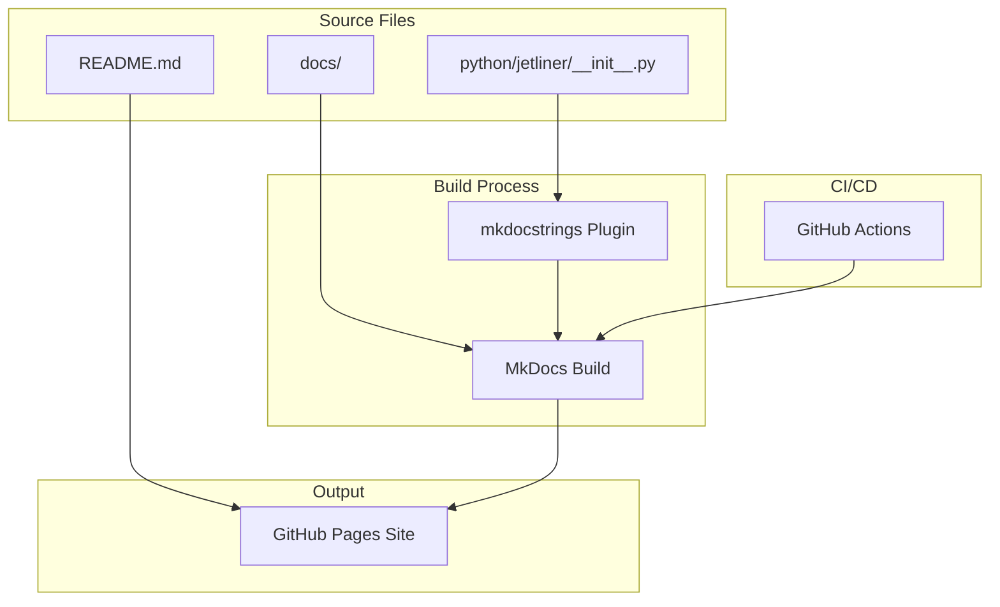

# Design Document: Jetliner Documentation

## Overview

This design describes a documentation system for Jetliner consisting of two main components: an enhanced README with practical examples, and a comprehensive MkDocs-based documentation site published via GitHub Actions. The documentation targets Python developers working with Avro data who need to understand both quick-start usage and detailed API behavior.

## Architecture



## Components and Interfaces

### Component 1: Enhanced README

The README serves as the project's front door, providing immediate value to developers evaluating the library.

**Structure:**
```
README.md
├── Header (name, badges, one-liner)
├── Features (bullet list)
├── Installation
├── Quick Start
│   ├── Basic scan() example
│   ├── S3 example
│   └── Query optimization example
├── API Overview (scan vs open)
├── Known Limitations
├── Documentation link
├── Development
└── License
```

**Badge Set:**
- PyPI version
- Python versions supported
- License
- Documentation status
- CI status

### Component 2: Documentation Site Structure

```
docs/
├── index.md                    # Getting Started (landing page)
├── installation.md             # Detailed installation guide
├── user-guide/
│   ├── index.md               # User guide overview
│   ├── local-files.md         # Reading local Avro files
│   ├── s3-access.md           # S3 access and authentication
│   ├── query-optimization.md  # Projection, predicate, early stopping
│   ├── streaming.md           # Memory-efficient streaming
│   ├── error-handling.md      # Error modes and recovery
│   ├── schemas.md             # Schema inspection and type mapping
│   └── codecs.md              # Codec support and selection
├── api/
│   ├── index.md               # API overview
│   └── reference.md           # Auto-generated API reference
├── performance/
│   ├── index.md               # Performance overview
│   ├── benchmarks.md          # Benchmark results
│   └── optimization.md        # Optimization tips
└── contributing.md             # Contributor guide
```

### Component 3: MkDocs Configuration

**mkdocs.yml:**
```yaml
site_name: Jetliner
site_description: High-performance Avro streaming reader for Polars DataFrames
site_url: https://[username].github.io/jetliner/
repo_url: https://github.com/[username]/jetliner
repo_name: jetliner

theme:
  name: material
  palette:
    - scheme: default
      primary: indigo
      accent: amber
      toggle:
        icon: material/brightness-7
        name: Switch to dark mode
    - scheme: slate
      primary: indigo
      accent: amber
      toggle:
        icon: material/brightness-4
        name: Switch to light mode
  features:
    - navigation.instant
    - navigation.tracking
    - navigation.sections
    - navigation.expand
    - navigation.top
    - search.suggest
    - search.highlight
    - content.code.copy
    - content.tabs.link

plugins:
  - search
  - mkdocstrings:
      handlers:
        python:
          options:
            show_source: true
            show_root_heading: true
            show_category_heading: true
            docstring_style: google
            merge_init_into_class: true

markdown_extensions:
  - pymdownx.highlight:
      anchor_linenums: true
  - pymdownx.superfences:
      custom_fences:
        - name: mermaid
          class: mermaid
          format: !!python/name:pymdownx.superfences.fence_code_format
  - pymdownx.tabbed:
      alternate_style: true
  - admonition
  - pymdownx.details
  - attr_list
  - md_in_html
  - toc:
      permalink: true

nav:
  - Getting Started: index.md
  - Installation: installation.md
  - User Guide:
    - Overview: user-guide/index.md
    - Local Files: user-guide/local-files.md
    - S3 Access: user-guide/s3-access.md
    - Query Optimization: user-guide/query-optimization.md
    - Streaming Large Files: user-guide/streaming.md
    - Error Handling: user-guide/error-handling.md
    - Schema Inspection: user-guide/schemas.md
    - Codec Support: user-guide/codecs.md
  - API Reference:
    - Overview: api/index.md
    - Reference: api/reference.md
  - Performance:
    - Overview: performance/index.md
    - Benchmarks: performance/benchmarks.md
    - Optimization Tips: performance/optimization.md
  - Contributing: contributing.md
```

### Component 4: GitHub Actions Workflow

**.github/workflows/docs.yml:**
```yaml
name: Documentation

on:
  push:
    branches: [main]
    paths:
      - 'docs/**'
      - 'mkdocs.yml'
      - 'python/jetliner/__init__.py'
      - 'README.md'
  workflow_dispatch:

permissions:
  contents: read
  pages: write
  id-token: write

concurrency:
  group: "pages"
  cancel-in-progress: false

jobs:
  build:
    runs-on: ubuntu-latest
    steps:
      - uses: actions/checkout@v4

      - name: Setup Python
        uses: actions/setup-python@v5
        with:
          python-version: '3.12'

      - name: Install dependencies
        run: |
          pip install mkdocs-material mkdocstrings[python]

      - name: Build documentation
        run: mkdocs build --strict

      - name: Upload artifact
        uses: actions/upload-pages-artifact@v3
        with:
          path: site/

  deploy:
    environment:
      name: github-pages
      url: ${{ steps.deployment.outputs.page_url }}
    runs-on: ubuntu-latest
    needs: build
    steps:
      - name: Deploy to GitHub Pages
        id: deployment
        uses: actions/deploy-pages@v4
```

## Data Models

### Documentation Page Model

Each documentation page follows a consistent structure:

```
Page
├── Title (H1)
├── Introduction (1-2 paragraphs)
├── Prerequisites (if applicable)
├── Main Content
│   ├── Sections with examples
│   └── Code blocks with copy buttons
├── Related Links
└── Next Steps
```

### Code Example Model

```python
# Example structure for documentation code blocks
"""
Each code example should:
1. Be self-contained (include imports)
2. Use realistic variable names
3. Include comments for non-obvious steps
4. Handle errors appropriately
5. Be copy-paste runnable where possible
"""

import jetliner
import polars as pl

# Read an Avro file with query optimization
result = (
    jetliner.scan("data.avro")
    .select(["user_id", "amount"])
    .filter(pl.col("amount") > 100)
    .collect()
)
```

## Correctness Properties

*A property is a characteristic or behavior that should hold true across all valid executions of a system—essentially, a formal statement about what the system should do. Properties serve as the bridge between human-readable specifications and machine-verifiable correctness guarantees.*

### Property 1: Code syntax validity

*For any* Python code block in the documentation (README or docs/), parsing the code with Python's `ast.parse()` should succeed without syntax errors.

**Validates: Requirements 1.6**

### Property 2: Documentation build success

*For any* valid state of the documentation source files, running `mkdocs build --strict` should complete with exit code 0.

**Validates: Requirements 7.3**

### Property 3: API reference completeness

*For any* symbol exported in `jetliner.__all__`, the API reference documentation should contain documentation for that symbol including its parameters, return type, and docstring.

**Validates: Requirements 5.1, 5.2, 5.3, 5.6**

## Error Handling

### Build Errors

| Error Type          | Cause                          | Resolution                           |
| ------------------- | ------------------------------ | ------------------------------------ |
| Missing reference   | Broken internal link           | Fix link path or create missing page |
| Invalid YAML        | mkdocs.yml syntax error        | Validate YAML syntax                 |
| Plugin error        | mkdocstrings can't find module | Ensure Python path includes source   |
| Strict mode failure | Warnings treated as errors     | Fix all warnings before deploy       |

### Deployment Errors

| Error Type         | Cause                    | Resolution                            |
| ------------------ | ------------------------ | ------------------------------------- |
| Permission denied  | GitHub Pages not enabled | Enable Pages in repo settings         |
| Branch not found   | Wrong branch configured  | Update workflow branch reference      |
| Artifact too large | Site exceeds size limit  | Optimize images, remove unused assets |

## Testing Strategy

### Documentation Testing

1. **Build Validation**: Run `mkdocs build --strict` in CI to catch broken links and syntax errors
2. **Link Checking**: Use mkdocs-linkcheck plugin to verify external links
3. **Code Example Testing**: Extract and run code examples using pytest-codeblocks (optional enhancement)

### Manual Review Checklist

- [ ] All code examples are copy-paste runnable
- [ ] Navigation is intuitive and complete
- [ ] Search returns relevant results
- [ ] Mobile rendering is acceptable
- [ ] Dark/light mode both work correctly

### CI Integration

```yaml
# Add to existing CI workflow
docs-check:
  runs-on: ubuntu-latest
  steps:
    - uses: actions/checkout@v4
    - uses: actions/setup-python@v5
      with:
        python-version: '3.12'
    - run: pip install mkdocs-material mkdocstrings[python]
    - run: mkdocs build --strict
```
